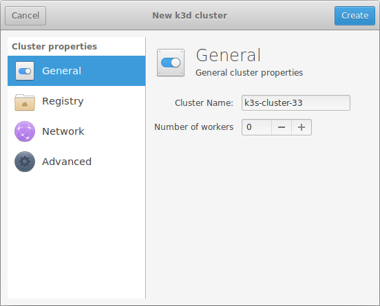
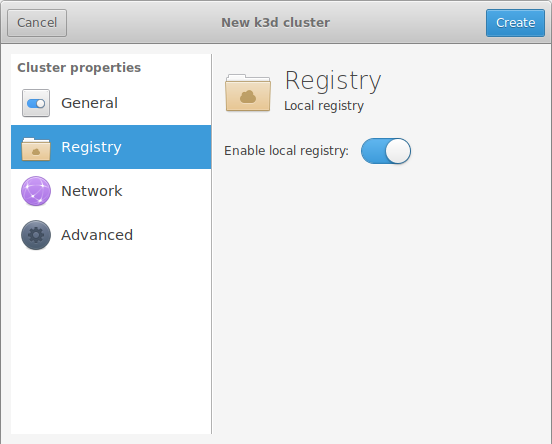
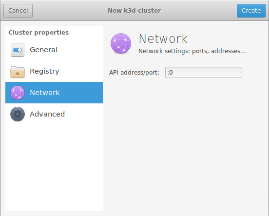
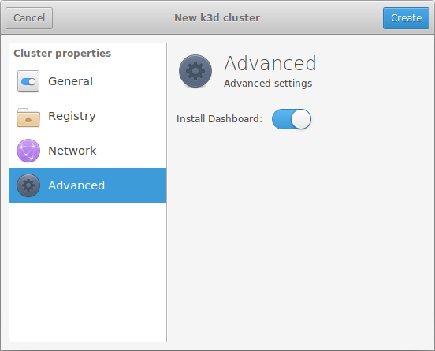

# Creating a new cluster

_NOTE: k3x is changing rapidly, so some of the screenshots shown in this page
could not correspond to the real state of the application._
 
## General settings

In this pane you can specify:
 
* the **name** of the cluster. A random name with the `k3s-cluster-*` will be prefilled
  automatically for you.
* the **number of workers** in the cluster. k3d will start with a master node
  that will also be used for running your workload, but you can add extra workers
  if you want an improved taste of a real cluster in production. 
 
## Registry

In this pane you can control if you want to connect the cluster to the local registry.
The local registry details are configured in the Preferences panel.

Note that the local registry is shared between all the clusters created. The creation
of the registry will be triggered when you create the first cluster that needs it,
and it will be destroyed when no more clusters are using it.

## Network

The network panel provides some configuration for:

* the **API server address/port**. You can use this for forcing the API server to
  bind to some specific address or port. When using the default `:0` value,
  a random, unused port will be found automatically before creating the cluster.
  We recommend leaving this field with the default value.

## Advanced settings

The advanced settings currently allow the installation of a Dashboard in the cluster.
The current Dashboard installed is Rancher, but this should be configurable in
the future for allowing some other alternatives. 