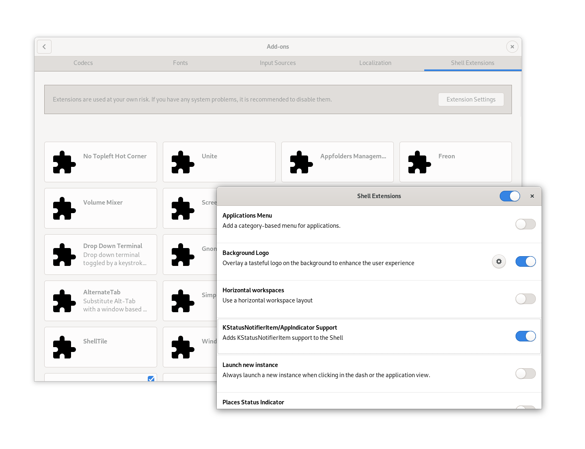

# Installation

## Adding Flatpak support in your OS

You can verify if your Linux distro already supports Flatpak by running:

```commandline
$ flatpak --version
Flatpak 1.4.4
```

If this command fails or it does not list anything, you must install Flatpak
by following [the instructions for you distribution](https://flatpak.org/setup/).

## Adding the `Flathub` repository

Make sure you have the [Flathub repo](https://flathub.org). You
can safely run the following command for adding the repo if not present:

```commandline
$ flatpak remote-add --user --if-not-exists flathub https://flathub.org/repo/flathub.flatpakrepo
```  

## Installing the k3x `.flatpak` file

If you already installed the Flathub repo, many modern distributions will simply
install the package when double clicking the `.flatpak` file.
But if this does not work in your distro, you should be able to install it from
command line with:

```commandline
$ flatpak install --user com.github.inercia.k3x.flatpak
```

When installing from command line, it will probably ask you about installing some
additional _runtimes_ if they are not already present (like the _GNOME_ runtime).
In that case, please accept the installation of all the dependencies. 

### Notes on some Linux distributions...

* **Fedora** _(and probably any other GNOME Shell environment)_.

  - Make sure the [Flathub repo has been added](#adding-the-flathub-repository).
  
  - Download the `.flatpak` file, but the installer does not work when double-clicking
    this file. Install the package [as described in the previous section](#installing-the-k3x-flatpak-file).
     
  - You need to install the `gnome-shell-extension-appindicator` RPM (or equivalent
    for your distribution) for showing the `k3x` system tray indicator.
    ```commandline
    $ yum search gnome-shell-extension-appindicator
    Last metadata expiration check: 0:44:07 ago on Sat 25 Apr 2020 05:59:09 AM EDT.
    ======================== Name Exactly Matched: gnome-shell-extension-appindicator ========================
    gnome-shell-extension-appindicator.noarch : AppIndicator/KStatusNotifierItem support for GNOME Shell
    $
    $ sudo yum install gnome-shell-extension-appindicator
    ...
    ```
    After installing this package, make sure it is enabled. In `GNOME Software`,
    under `Addons` > `Shell Extensions` > `Extension settings`, enable the
    `KStatusNotifier/Appindicator Support`, like this:
   
   
* **Ubuntu**, **Elementary OS** and other derivatives.

  - Make sure the [Flathub repo has been added](#adding-the-flathub-repository).

  - Installation seems to work fine when double-clicking the `.flatpak` file, even though
    the installer  seem to be stuck at _0%_ while installing dependencies. The following
    video shows what happens in Ubuntu when you just `Open with...` the file after
    downloading the `.flatpak`:

    
    
    Even though the installer is stuck for a while, the `.flatpak` will be eventually installed.
    
  - After that, it seems to works right out of the box (please [report an issue](https://github.com/inercia/k3x/issues/new/choose) if it doesn't).

* **OpenSUSE** (and KDE environments).

  - Make sure the [Flathub repo has been added](#adding-the-flathub-repository).

  - Download the `.flatpak` file, but the installer does not work when double-clicking
    this file.

  - Install the package [as described in the previous section](#installing-the-k3x-flatpak-file).
    It seem to work right out of the box (please [report an issue](https://github.com/inercia/k3x/issues/new/choose) if it doesn't).

<p>&nbsp;</p>
<p>&nbsp;</p>


### Troubleshooting

* **I have double clicked the `.flatpak`, it opens an installer but it has been stuck at _0%_ for a while.... What should I do?**.

  Please be patient. The system installer is installing dependencies
  under the hood, but it is not reporting the progress in the UI. This seem to happen in
  Ubuntu (and other Linux distros based in Ubuntu).

* **I get this error when installing the `.flatpak` file: `error: The application
  com.github.inercia.k3x/x86_64/master requires the runtime org.gnome.Platform/x86_64/3.3
  which was not found`**.

  First, make sure the Flathub repository is installed by running this command:
  ```commandline
  $ flatpak remote-add --user --if-not-exists flathub https://flathub.org/repo/flathub.flatpakrepo
  ```

  Then you should be able to install `k3x` with `flatpak install` and that should
  automatically download all the dependencies, like this:

  ```commandline
  $ flatpak install --user com.github.inercia.k3x.flatpak
  Required runtime for com.github.inercia.k3x/x86_64/master (runtime/org.gnome.Platform/x86_64/3.34) found in remote flathub
  Do you want to install it? [Y/n]: 

  com.github.inercia.k3x permissions:
      ipc      network     wayland     x11     file access [1]     dbus access [2]

      [1] /run/docker.sock, home, xdg-run/dconf, ~/.config/dconf:ro
      [2] ca.desrt.dconf, org.freedesktop.Notifications, org.kde.StatusNotifierWatcher


          ID                                              Arch              Branch            Remote                 Download
   1. [✓] org.gnome.Platform                              x86_64            3.34              flathub                306.1 MB / 320.4 MB
   2. [✓] org.gnome.Platform.Locale                       x86_64            3.34              flathub                 16.8 kB / 322.2 MB
   3. [✓] org.freedesktop.Platform.GL.default             x86_64            19.08             flathub                 94.9 MB / 94.9 MB
   4. [✓] org.gtk.Gtk3theme.Yaru                          x86_64            3.22              flathub                233.3 kB / 231.9 kB
   5. [✓] org.freedesktop.Platform.openh264               x86_64            2.0               flathub                918.1 kB / 916.8 kB
   6. [✓] com.github.inercia.k3x                          x86_64            master            k3x1-origin            < 0 bytes

  Installation complete.
  ```

  You could also to force the installation of the dependencies with:
  
  ```commandline
  $ flatpak install --user org.gnome.Platform/x86_64/3.34
  ```


